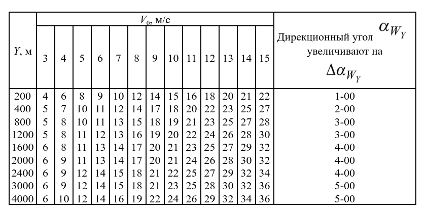

\usepackage{amsmath}

# Алгоритм расчета 
Тип оборудования: **Десатный метео комплект (`ДМК`)**

1. `Отклонение наземного давления атмосферы` $ΔH_{0}$ (мм рт. ст.) и отклонение наземной виртуальной температуры воздуха (град) на уровне метеорологического поста. Отклонение наземного давления атмосферы $ΔH_{0}$, записываемое в бюллетень, определяется как разность измеренного давления Н0 и табличного значения наземного давления, равного 750 мм рт. ст., т. е. $ΔН_{0} = Н_{0} – 750$.
Если измеренное давление будет больше 750 мм рт. ст., то отклонение ΔН0 имеет знак «плюс», если меньше – знак «минус».

2. `Отклонение приземной виртуальной температуры` ,  записываемое в бюллетень, определяется как разность между приземной виртуальной температурой, измеренной метеорологическим постом, 
и ее табличным значением, равным **+15,9°С**, т.е.

>
> $ΔT_{0}^{мп}$ = T0  – 15,9
>
>
>Если приземная  виртуальная температура будет больше +15,9°С, 
> от отклонение  имеет знак **«плюс»**, если меньше – знак **«минус»**.
> Приземная виртуальная температура τ0 вычисляется по формуле:
> 
> T0 = t0  + $ΔТ_{V}$
> 
> где:
> - t0 - измеренная приземная температура воздуха. Берется из ячейки > `температура`
> - $ΔТ_{V}$ - виртуальная поправка, определяемая по таблице 1.

**Таблица 1**
|  $t_{0}$ | Ниже 0 | 0 - 5 | 10 - 15 | 20 | 25 | 30 | 40 |
|----------|--------|-------|---------|----|----|----|----|
| $ΔТ_{V}$ | 0      | 0.5   | 1       | 1.5  | 2  | 3.5 | 4.5 |

3. `Средние отклонения температуры воздуха`  $Δt_{Y}$, направление и скорость среднего ветра определяются для стандартных слоев до высоты **4 км**. Среднее отклонение температуры воздуха Y в пределах стандартных высот бюллетеня определяется по таблице 2.

**Таблица 2**

> Входами в таблицы являются стандартные высоты бюллетеня Y 
> и отклонение приземной виртуальной температуры.
> 
> **Среднее отклонение температуры** при отрицательных значениях  указано > в числителе дроби, при положительных – в знаменателе дроби.
> 
> Для отклонений $Δt$ между **10 и 20, 20 и 30 и т. д.** среднее отклонение температуры Y определяется путем сложения величины отклонений из столбцов, соответствующих целому числу десятков и числу единиц.

#### Пример расчета
- **Исходные данные**: измеренная приземная температура воздуха $t0$ = +3
- **Решение**:

T0 = t0  + $ΔТ_{V}$ 
T0 = +3 + 0,3 = + 3,3

$ΔT_{0}^{мп}$ = T0  – 15,9 
$ΔT_{0}^{мп}$ = +3,3 - 15,9 =  -12,6 = -13 (округлили)

По **таблице 2**  начинаем считать отклонение для каждой стандартной высоты. 

**200 метров**: `-13` раскладываем на два числа: `-10` и `-3`, в таблице находим соответствующие им значения для 200 метров и складываем их. 
Для `-10` значение **-9**, для `-3` значение **-3**.  

Отклонение температуры для стандартной высоты 200 метров будет равно:        
`-9 + (-3) = -12`  
 
Далее из-за того, что полученное значение отрицательное к его модулю необходимо прибавить `50 -> |-12| + 50 = 62`. 
Число **62** необходимо записать в столбец отклонения температуры для высоты 200 метров (**02**). 

4. `Скорость среднего ветра` $W_{у}$ для всех стандартных высот бюллетеня определяется по **таблице 3**

**Таблица 3**

> Входами в таблицы являются стандартные высоты 
Y и скорости приземного ветра $V_{0}$.
> При скорости приземного ветра $V_{0}$  < 3 м/с для всех стандартных высот Y скорость среднего ветра принимается равной нулю. В этом случае в бюллетене для всех стандартных высот Y места цифр, отведенные для направления и скорости ветра, заполняются нулями. Среднее значение скорости округляют до 1 м/с.

5. `Направление среднего ветра` $α_{WY}$ для всех стандартных высот определяется по формуле: 
$α_{WY} = α_{V0} + Δα_{WY}$

где 
$α_{V0}$ – направление приземного ветра; 
$Δα_{WY}$ – приращение среднего ветра относительно направления приземного ветра, определяемое по **таблице 3**

> Для высот более **4000** метров данные просто копируются из значений на 4000 метров. 
> Для высот менее **200** метров данные просто копируются из значений на 200 метров.

