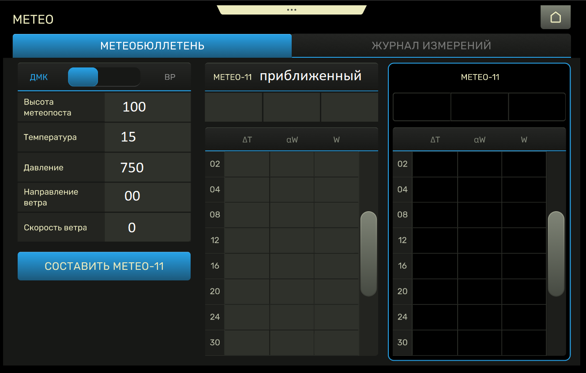
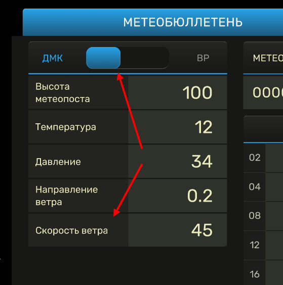
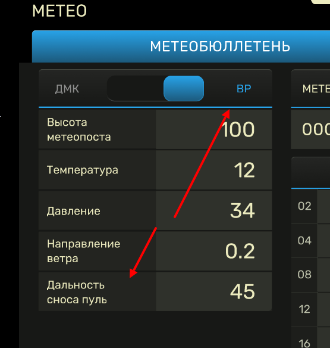
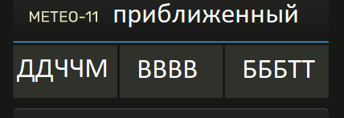

\usepackage{amsmath}

# Техническое задание

> В рамках `Гособоронзаказа` необходимо разработать программно-аппаратный комплекс (`ПАК`) для автоматизации расчетных задач поддержки артиллерии. Для проведения расчетно-огневых задач требуется регулярное измерение метрологических характеристик на различных участках фронта. 

В качестве входных данных используются:

- Тип оборудования
- Высота ДМК
- Температура воздуха на высоте метеопоста
- Давление атмосферы на высоте метеопоста
- Направление ветра в приземном слое воздуха
- Скорость ветра в приземном слое воздуха

Результат расчета оформляется в виде таблицы:

- Высота (`H`)
- Среднее отклонение температуры (`TT`)
- Дирекционные угол направление ветра (`HH`)
- Скорость среднего ветка (`СС`)

Интерфейс:

|

## Описание
Система должна состоять из двух частей
1. Метеобюллетень
2. Журнал измерений

На первой вкладке `метеобюллетень` производится текущий расчет, а так же отображаются текущие `сохраненные` результаты расчета.
На второй вкладке `журнал измерений` отображается история измерений с набором дополнительного функционала.

1. Переключатель выбора режима расчета приближенного метеобюллетеня предназначен для выбора **оборудования** для проведения измерений. Есть два варианта составления приближенного метеобюллетеня: 
* С использованием десантный метео комплект (`ДМК`)
* С использованием ветрового ружья (`ВР`)

Отличаются эти варианты исходными данными для составления приближенного метеобюллетеня и математическими расчтами.

При выборе `ДМК` в области исходных данным последняя строка `Скорость ветра`. 

Пример:

При выборе `ВР` в области исходных данным последняя строка `Дальность сноса пуль`.

Пример

2. Ячейки исходных данных данных по умолчанию должны содержать следующие значения:

| Параметр     | Значение по умолчанию   |
|--------------|-------------------------|
| Высота метеопоста | **100**       |
| Температура   | **15** |
| Давление    | **750** |
| Направление ветра | **00** |
| Скорость ветра | **0** |
| Дальность сноса пуль | **0** |

3. `Высота метеопоста`. Значения - целые числа, могут быть отрицательными и положительными и нулем, указывается в метрах над уровнем моря

4. `Температура`. Значения - дробные числа с одним знаком после запятой, могут быть отрицательными и положительными, нулем Минимальное значение `-58`, максимальное  `58`, указывается в цельсиях

5. `Давления`. Значения -  целые числа, могут быть только положительными. Минимальное значение `500`, максимальное  `900`, указывается в мм рт ст

6. `Направление ветра`. Значение всегда стоит из двух разрядов. Минимальное значение `0`,` максимальное значение `59`. Направление ветра указывается в больших делениях угломера

7. `Скорость ветра`. Значения -  целые числа, могут быть только положительными, либо нулем. Минимальное значение `0`, максимальное  `15`, указывается в м/с. (`Ячейка есть если выбран вариант составления метеобюллетеня с использованием ДМК`)

8. `Дальность сноса пуль` Значения -  целые числа, могут быть только положительными, либо нулем. Минимальное значение `0`, максимальное  `150`, указывается в м. (`Ячейка есть если выбран вариант составления метеобюллетеня с использованием ВР`)

9. Кнопка `Составить МЕТЕО-11` становится активна для пользователя, когда он заполнены все ячейки с исходными данными. После нажатия кнопки на форме происходит заполнение таблицы `Метео-11 ПРИБЛИЖЕННЫЙ` и появляется кнопка `Принять как Действ.` (принять как действующий)

Пример:

### Приближенный
В качестве характеристик полученных результатов расчета оформляется как _заголовок_ к таблице с результатами расчета. 

* **ДДЧЧМ** - ДД - день (число) месяца, ЧЧМ - часы (ЧЧ)  и десятки минут (М) окончания зондирования атмосферы (время измерения). 

Пример: `24093` - 24 число месяца, время измерения 09.30 минут. Данные должны браться из системной даты и времени

* **ВВВВ** - высота расположения метеопоста над уровнем моря. 

Пример: `0060` - 60 метров над уровнем моря. Значение берется из ячейки `Высота метеопоста`

* **БББТТ** :  
**БББ** - отклонение наземного давления атмосферы от табличного на уровне метеорологической станции на момент окончания зондирования атмосферы (измерения). Отклонение наземного давления атмосферы ΔНо, записываемое в бюллетень, определяют как разность измеренного давления Но и табличного значения наземного давления, равного 750 мм рт. ст., т. е. `ΔНо = Но — 750` 

Если измеренное давление будет больше 750 мм рт. ст., то отклонение ΔНо имеет знак «плюс» 

Пример `ΔНо = 757 — 750 = 7` мм рт. ст. Отклонение +7 мм.рт.ст. записывается  в виде 007, отклонение +13 мм. рт. ст. записывается в виде `013`), если меньше — знак «минус» 

Пример `ΔНо = 743 — 750 = — 7` мм рт. ст., Если отрицательное значение то в начале ставится число **пять**. Отклонение -7 мм.рт.ст. записывается  в виде `507`, отклонение `- 13` мм. рт. ст. записывается в виде `513`) .

Значение берется из ячейки `Давление`

* **ТТ** - отклонение наземной виртуальной температуры от табличного на уровне метеорологической станции на момент зондирования атмосферы (измерения) в градусах. 

#### Расчет температуры (ТТ)

Отклонение приземной виртуальной температуры ,  записываемое в бюллетень, определяется как разность между приземной виртуальной температурой, измеренной метеорологическим постом, 
и ее табличным значением, равным +15,9°С, т.е.

$ΔT_{0}^{мп}$ = T0  – 15,9

Если приземная  виртуальная температура будет больше +15,9°С, 
от отклонение  имеет знак **«плюс»**, если меньше – знак **«минус»**.
Приземная виртуальная температура τ0 вычисляется по формуле:

T0 = t0  + $ΔТ_{V}$

где:
- t0 - измеренная приземная температура воздуха. Берется из ячейки `температура`
- $ΔТ_{V}$ - виртуальная поправка, определяемая по таблице 1.

**Таблица 1**
|  $t_{0}$ | Ниже 0 | 0 - 5 | 10 - 15 | 20 | 25 | 30 | 40 |
|----------|--------|-------|---------|----|----|----|----|
| $ΔТ_{V}$ | 0      | 0.5   | 1       | 1.5  | 2  | 3.5 | 4.5 |

##### Примеры расчета температуры
- `Пример 1`: 
    
    измеренная температура = `23`  
    1. T0 = t0  + $ΔТ_{V}$

    > T0 = 23 + 1,8 = 24,8  
    > _(1,8 это интерполированное значение виртуальной поправки из `таблицы 1`)_

    2. $ΔT_{0}^{мп}$ = T0  – 15,9

    > $ΔT_{0}^{мп}$ = 24,8-15,9 = 9  
    > _(получается 8.9, но округляем до 9)_ 
    
    Записывается в виде **09**

### Алгоритмы расчета

1. **Наименование задачи**: `составление приближенного бюллетеня «Метеосредний» по результатам наземных измерений с использованием метеорологического поста`

- [Описание алгоритма расчета](./AlgoritmDmk.md)

2. **Наименование задачи**: `составление приближенного бюллетеня «Метеосредний» по результатам наземных измерений с использованием ветрового ружья`

- [Описание алгоритма расчета](./AlgoritmBp.md)

